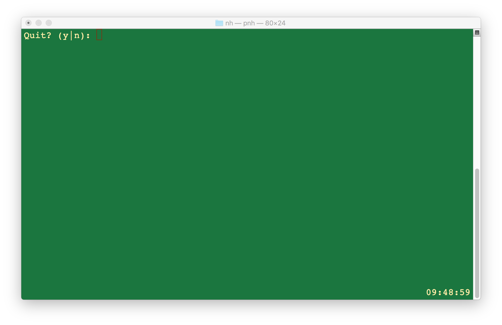
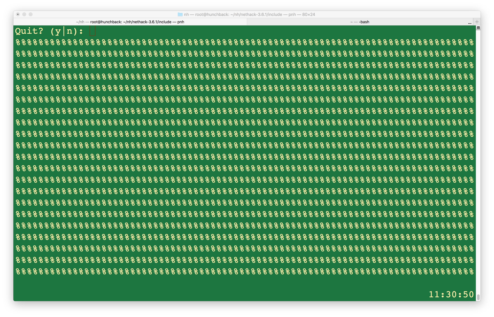
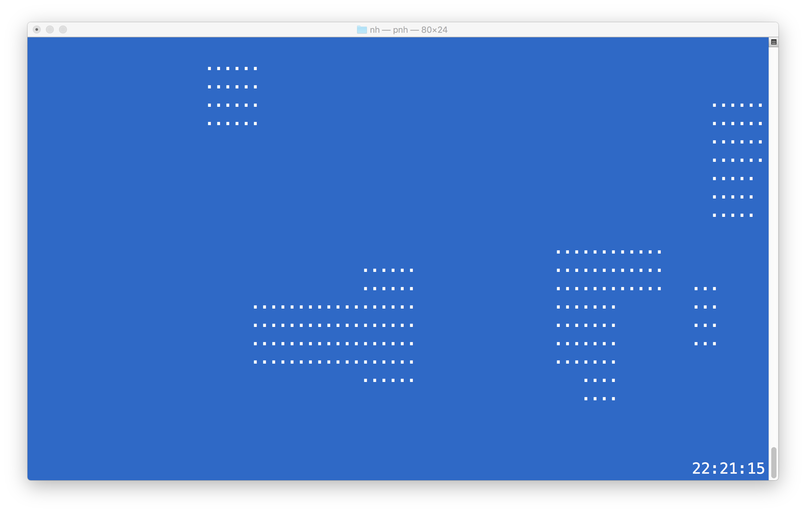
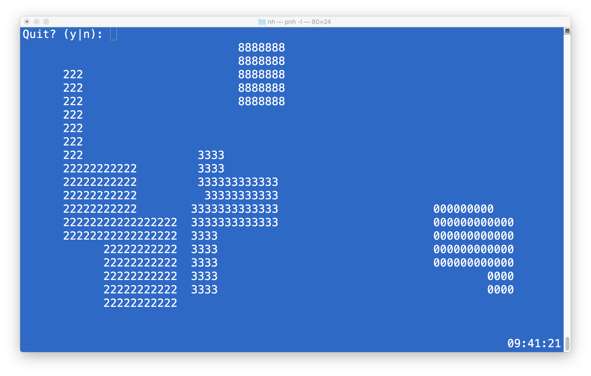
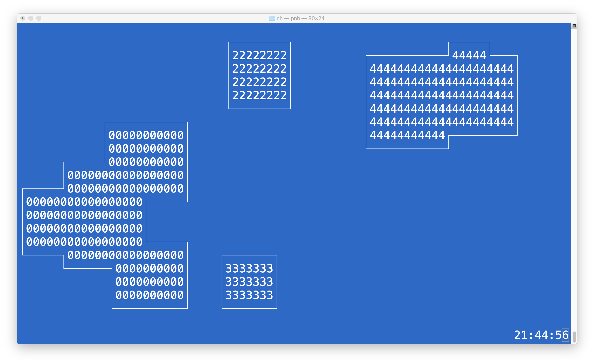
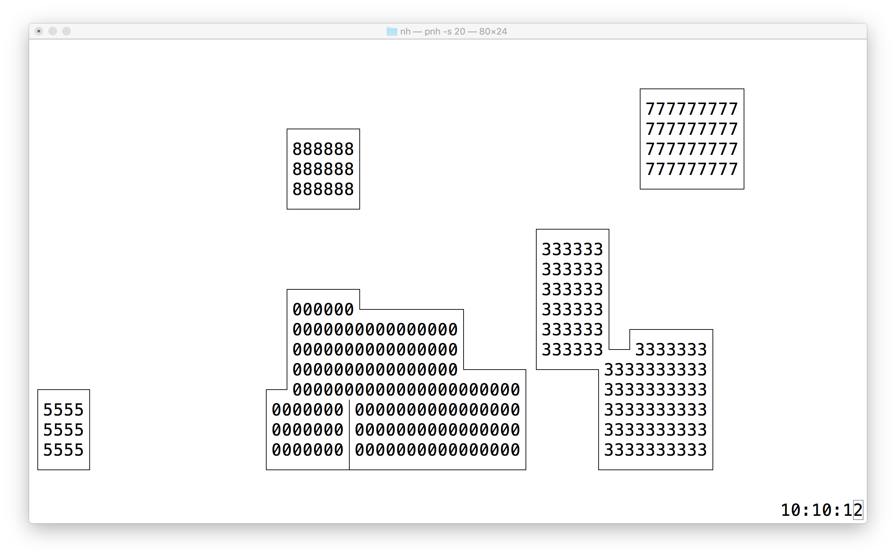
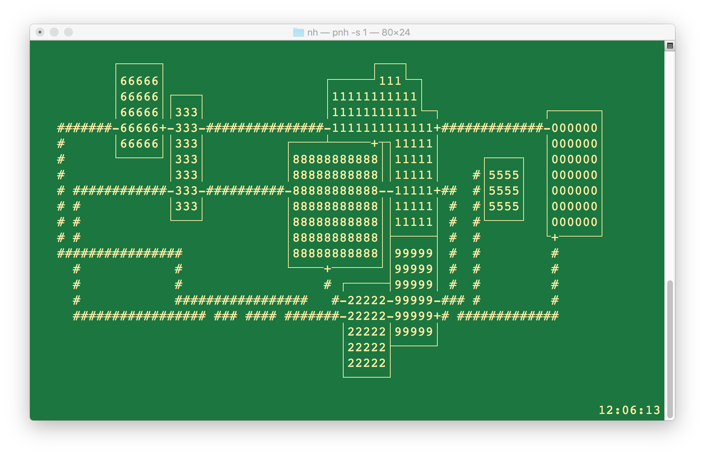

# 5/2/2018 - 01

First few lines of code written and added to github. Nothing much.

# 5/4/2018 - 01

* Added a cool makefile that accounts for *depends*.
* Added to Presentation class to keep the screen and keyboard at arm's length and nicely encapsulated.
* Added to Game class making ```main()``` trivial.
* (q)uit command

# 5/4/2018 - 02

* Decided to use C++ 2020 for ```enum class```.
* Improved logging code - cannot avoid C macros.
* Continued abstracting ```curses``` into the Presentation class. 

# 5/4/2018 - 03

* Dropped ```enum class```. Oh well. TTY modes are bit masks now.
* Neat TTY hack that allows me to seamlessly shift between blocking and nonblocking I/O.
* (^v)ersion command.

# 5/5/2018 - 01

* Underpinnings of levels coming along nicely.
* Decided to start factoring in multithreading now rather than later. It it isn't used, oh well.
* My first usage of lock_guard. Nice use of OO.

Check out this amazing screen shot:



# 5/5/2018 - 02

* Have beginnings of rendering working. I have separated the need for rendering the map versus versus status information. Felt like the right thing to do - probably doesn't matter.



# 5/5/2018 - 03

* Rudimentary beginnings of rooms.



# 5/6/2018 - 01

* Removed mutex support. Never code multithreaded applications on an empty mind.
* Rooms being platted and overlaps collapsed.



# 5/7/2018 - 01

* Walls almost done. Better than I did last time I tried this.



# 5/7/2018 - 01

* Walls may be done - very happy with them. Next comes hallways.



# 5/9/2018 - 01

* Found about 10 more "corner cases" and fixed these (walls).
* Wrote means of "characterizing" rooms in preparation for hallway generation.
* Described current plan for hallway generating algorithm.

# 5/23/2018 - 01

A lot of development has been done without making entries here. This image
depicts the current state of level development. More to come such as adding
jinks and ensuring all rooms are connected.



