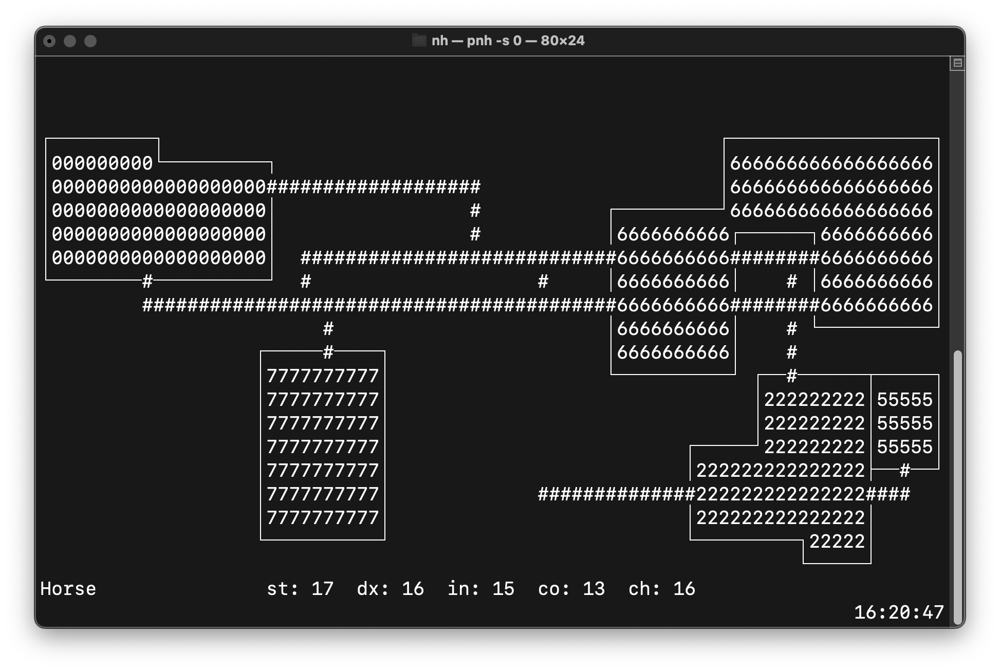
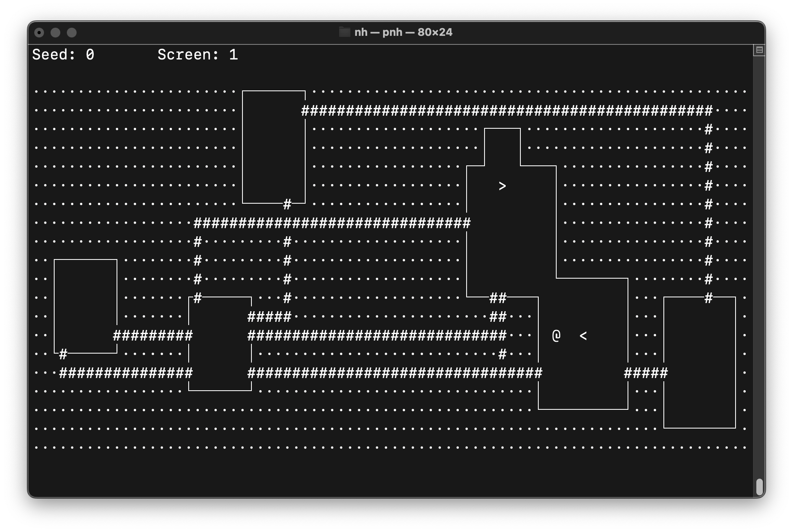

# PNH Development Log

## 5/2/2018 - 01

First few lines of code written and added to github. Nothing much.

## 5/4/2018 - 01

* Added a cool makefile that accounts for *depends*.
* Added to Presentation class to keep the screen and keyboard at arm's
  length and nicely encapsulated.
* Added to Game class making ```main()``` trivial.
* (q)uit command

## 5/4/2018 - 02

* Decided to use C++ 2020 for ```enum class```.
* Improved logging code - cannot avoid C macros.
* Continued abstracting ```curses``` into the Presentation class. 

## 5/4/2018 - 03

* Dropped ```enum class```. Oh well. TTY modes are bit masks now.
* Neat TTY hack that allows me to seamlessly shift between blocking and
  nonblocking I/O.
* (^v)ersion command.

## 5/5/2018 - 01

* Underpinnings of levels coming along nicely.
* Decided to start factoring in multithreading now rather than later. It
  it isn't used, oh well.
* My first usage of lock_guard. Nice use of OO.

Check out this amazing screen shot:


## 5/5/2018 - 02

* Have beginnings of rendering working. I have separated the need for
  rendering the map versus versus status information. Felt like the
  right thing to do - probably doesn't matter.


## 5/5/2018 - 03

* Rudimentary beginnings of rooms.


## 5/6/2018 - 01

* Removed mutex support. Never code multithreaded applications on an
  empty mind.
* Rooms being platted and overlaps collapsed.


## 5/7/2018 - 01

* Walls almost done. Better than I did last time I tried this.


## 5/7/2018 - 01

* Walls may be done - very happy with them. Next comes hallways.


## 5/9/2018 - 01

* Found about 10 more "corner cases" and fixed these (walls).
* Wrote means of "characterizing" rooms in preparation for hallway
  generation.
* Described current plan for hallway generating algorithm.

## 5/23/2018 - 01

A lot of development has been done without making entries here. This
image depicts the current state of level development. More to come such
as adding jinks and ensuring all rooms are connected.


## 11/06/2022 - 01

Four years and six months since I last touched this code.

Removed support for doors as I found them ugly in rendering as well as
silly in the context of a series of caves.

Started on the notion of a player.

Current rendering:



Got to say, the floor plan generator looks great. How the tiles are
stored may need to change. Currently they are stored in a single
vector used as a 2D array. I might want to switch this up to a *map*,
for example, where the coordinate pair is the key value. Dunno. Need
to think about this.

## 11/08/2022 - 01

Completely rewrote the entire program yesterday. What I have now is
far fewer lines and far less complicated. Have the player moving
around a little bit, even.



## 11/10/2022 - 01

More than 330 special cases of line drawing implemented. In theory
there are 3^9 potential 3X3 combinations but in practice there
should be far fewer. Waiting for theory and practice to coincide.
